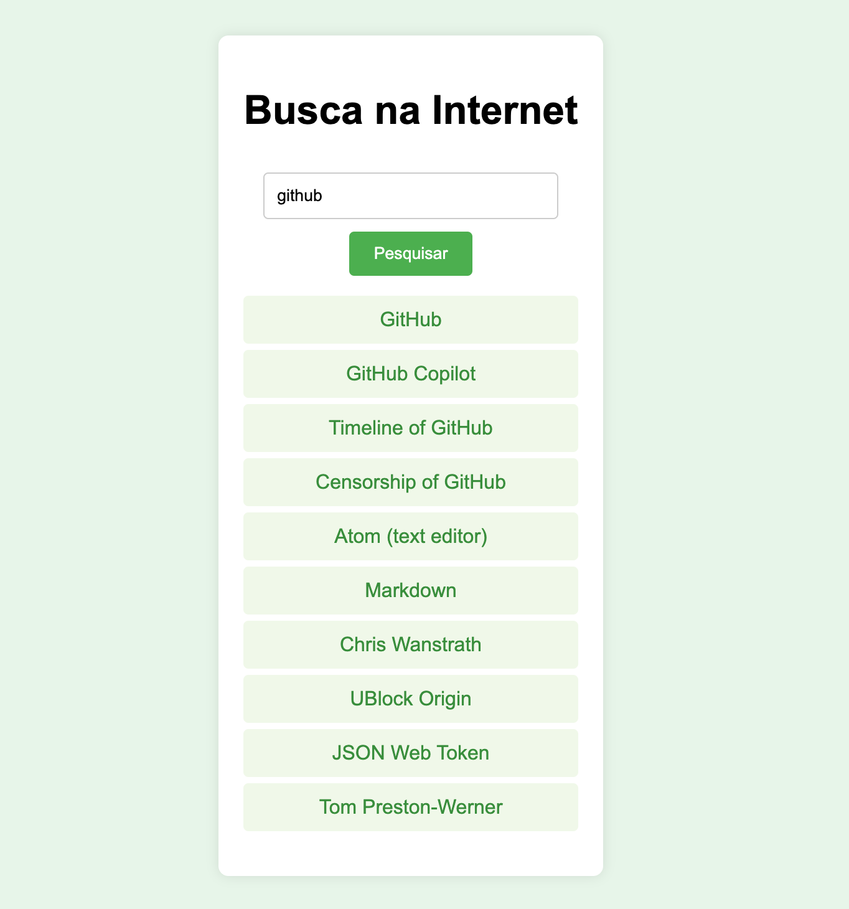

# Projeto de Busca na Wikipedia

Este é um projeto simples de busca na Wikipedia usando HTML, CSS e JavaScript. 
Ele permite aos usuários inserir um termo de busca e obter resultados diretamente da Wikipedia.


## Funcionalidades

- **Busca Simples:** Insira um termo na caixa de busca e clique no botão "Pesquisar".
- **Resultados:** Os resultados da busca são exibidos como links para os artigos da Wikipedia.


## Como Usar

1. Clone este repositório:

   ```bash
   git clone https://github.com/seu-usuario/nome-do-repositorio.git